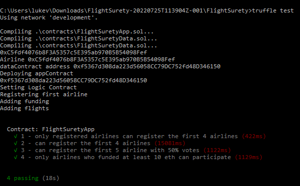
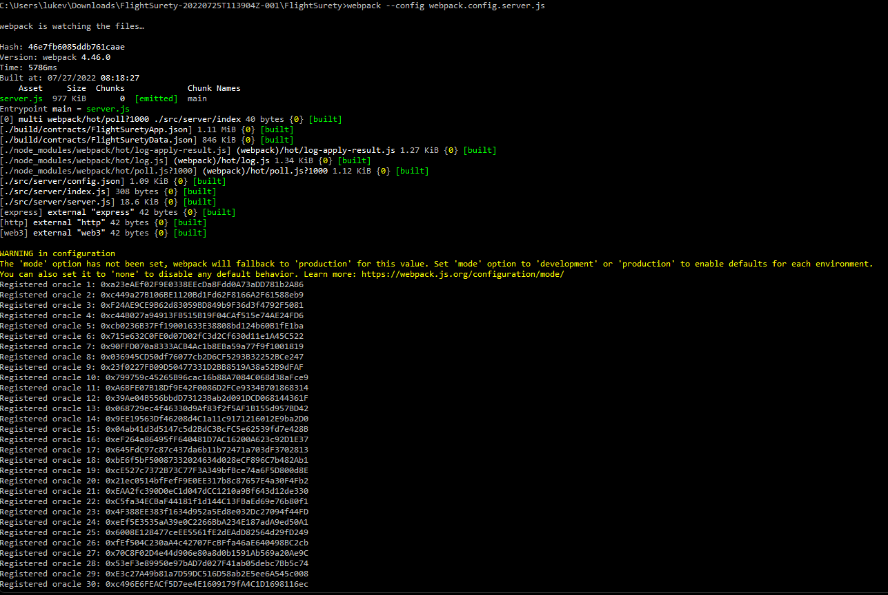

# FligthSurety - Dapp with autonomous smart contract and oracles

In this repository you will find the code for the FlightSurety project.  This project is a prototype of an airline insurance flight mechanism which will allow users to get a 1.5X refund in case of a flight delay.  There is a multiparty consensus mechanism to add new airlines to the pool.

## Tools and technologies used

This application uses a wide variety of technologies in order to be implemented.  The following versions are required in order to execute the code

* Truffle - v5.0.2 (core: 5.0.2)

* Solidity - ^0.4.24 (SOL-JS)

* Node - V12.13.0

* Web3.js - v1.3.6

* Ganache CLI - v6.12.2 (ganache-core: 2.13.2)
​
## Testing 

The application has been tested using both code and even manually.
​
In test\Airline.js there are 4 tests as explained below

* Ensures only the registered airline registers teh first 4 airlines 

* The first 4 airlines can be registered 

* The 5th and subsequent airlines have to be approved by at least 50% of the registered airlines

* Airlines have to fund a minimum of 10 eth before participating

Below is an image showing the registered oracles

The below image demonstrates the UI of the Dapp with and example of a successful claim

​